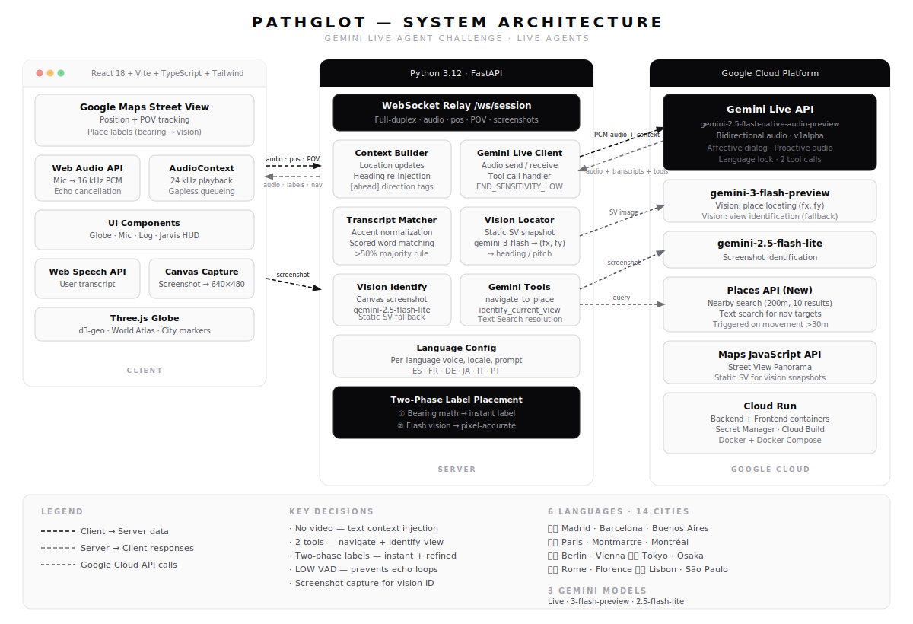

# PathGlot

**Walk the streets of a foreign city. Your AI guide speaks only in the local language.**

PathGlot drops you into Google Street View while a Gemini Live voice agent acts as your personal tour guide — narrating landmarks, answering questions, and navigating the city, all in the language you're learning. Move through the streets and your guide dynamically references the real places around you in real time.

> Built for the **[Gemini Live Agent Challenge](https://googleai.devpost.com)** · Category: **Live Agents**
> `#GeminiLiveAgentChallenge`

---

## Demo

**[▶ Watch Demo Video](https://www.youtube.com/watch?v=x8xgqN6Dw-4)**

---

## Architecture



**How it works:**

1. You walk through a foreign city in Google Street View
2. Your mic audio streams live to the backend at 16 kHz
3. The backend relays audio to **Gemini Live API** (native audio, v1alpha) with injected location context from the **Google Places API**
4. Gemini responds in the target language — narrating the real places around you
5. When Gemini mentions a place, a label appears on screen instantly (bearing math), then refines to pixel-accurate position via a background **Gemini Flash** vision call
6. If you ask "what is that?" — the `identify_current_view` tool captures a screenshot from your browser, sends it to **Gemini Flash** for identification, then injects the answer into the live session
7. Heading changes >60° trigger context re-injection so the agent always knows what direction you're facing

---

## Features

- **Real-time voice conversation** — full-duplex audio via Gemini Live API, interruptible at any time
- **Grounded in real data** — agent only discusses verified Google Places data; says "I'm not certain" instead of hallucinating
- **Two registered tools** — `navigate_to_place` (teleport to a place) and `identify_current_view` (screenshot-based identification)
- **Two-phase place labels** — instant bearing-based labels, refined to pixel accuracy by Gemini Flash vision
- **Screenshot-based identification** — captures the actual browser canvas when the user asks "what is that?"
- **Dynamic context** — location and heading re-injected automatically as you move and pan
- **6 languages × 14 cities** — Spanish, French, German, Japanese, Italian, Portuguese
- **No video streaming** — structured text context injection is more reliable than Gemini's 1 FPS video cap
- **3D interactive globe** — Three.js city selector on the landing page with country outlines and flag overlays
- **Affective dialog** — emotion-aware, more human-like guide responses via v1alpha API
- **Jarvis HUD** — floating transcript overlay with auto-fade lifecycle

---

## Supported Languages & Cities

| Language | Cities |
|---|---|
| 🇪🇸 Spanish | Madrid · Barcelona · Buenos Aires |
| 🇫🇷 French | Paris · Montmartre · Montréal |
| 🇩🇪 German | Berlin · Vienna |
| 🇯🇵 Japanese | Tokyo (Shibuya) · Osaka |
| 🇮🇹 Italian | Rome · Florence |
| 🇵🇹 Portuguese | Lisbon · São Paulo |

---

## Tech Stack

| Layer | Technology |
|---|---|
| Frontend | React 18 + Vite + TypeScript |
| Styling | Tailwind CSS |
| 3D Globe | Three.js + React Three Fiber + d3-geo |
| Maps | Google Maps JavaScript API |
| Audio | Web Audio API (16 kHz capture · 24 kHz playback) |
| User Transcription | Web Speech API (language-aware) |
| Backend | Python 3.12 + FastAPI |
| AI (voice) | Gemini Live API — `gemini-2.5-flash-native-audio-preview-12-2025` (v1alpha) |
| AI (vision locate) | `gemini-3-flash-preview` — place locating in Street View images |
| AI (vision identify) | `gemini-2.5-flash-lite` — screenshot identification |
| Places | Google Places API (New) — nearby search + text search |
| Hosting | Google Cloud Run (backend + frontend) |
| CI/CD | Cloud Build + Artifact Registry + Secret Manager |
| Containers | Docker + Docker Compose |

---

## Local Development

### Prerequisites

- Docker + Docker Compose
- A Gemini API key — [Google AI Studio](https://aistudio.google.com) → API Keys
- A Google Maps API key — [Google Cloud Console](https://console.cloud.google.com) → APIs & Services → Credentials

### Required Google Cloud APIs

Enable these in your GCP project:

- Maps JavaScript API
- Places API (New)
- Street View Static API

### Setup

```bash
git clone https://github.com/chase-west/PathGlot
cd PathGlot
cp .env.example .env
```

Edit `.env`:

```env
GEMINI_API_KEY=your_gemini_api_key
GOOGLE_MAPS_API_KEY=your_maps_api_key
GOOGLE_CLOUD_PROJECT=your_gcp_project_id   # optional, for Cloud Run deploy
CLOUD_RUN_REGION=us-central1               # optional
```

```bash
docker-compose up
```

Open **http://localhost:5173**

> **Note:** `GEMINI_API_KEY` is optional for local dev — the app works with bearing-based place labels even without it. Vision-refined labels and "what is that?" identification require it.

---

## Deploy to Google Cloud Run

```bash
chmod +x backend/deploy/deploy.sh
./backend/deploy/deploy.sh
```

This script:
1. Creates an Artifact Registry repository
2. Builds and pushes Docker images for backend + frontend
3. Deploys both services to Cloud Run (us-central1)
4. Configures secrets via Secret Manager

Alternatively, use Cloud Build for CI/CD:

```bash
gcloud builds submit --config=backend/deploy/cloudbuild.yaml \
  --substitutions="_REGION=us-central1"
```

---

## Testing Checklist

| Test | Expected |
|---|---|
| Select Spanish + Madrid → allow mic → walk Street View | Hear AI narrating in Spanish |
| Speak English to the guide | Agent redirects the conversation back in Spanish |
| Move >30m | Agent references new neighborhood within next response |
| 10+ minute session | No drops or degradation |
| Agent mentions a place | Label appears instantly, then refines position |
| Ask "what is that?" while looking at something | `identify_current_view` fires; agent identifies and labels it |
| Agent mentions something not in Places API (statue, plaza) | Vision fallback labels it |
| Pan camera >60° | Agent's direction references update to match new view |
| No `GEMINI_API_KEY` set | App works with bearing-based labels; no vision errors |

---

## Project Structure

```
pathglot/
├── backend/
│   ├── main.py              # FastAPI app, WebSocket handler, session logic
│   ├── gemini_client.py     # Gemini Live API client (audio relay, tool calls)
│   ├── places_client.py     # Google Places API (New) — nearby + text search
│   ├── context_builder.py   # Location/heading context injection
│   ├── vision_locate.py     # Gemini Flash vision — place locating + identification
│   ├── language_config.py   # Per-language voices, prompts, guide names
│   ├── requirements.txt     # Python dependencies
│   ├── Dockerfile           # Backend container
│   └── deploy/
│       ├── deploy.sh        # Cloud Run deploy script
│       └── cloudbuild.yaml  # Cloud Build CI/CD pipeline
├── frontend/
│   ├── index.html           # Entry HTML (Inter font, meta tags)
│   ├── Dockerfile           # Frontend container
│   ├── nginx.conf           # Production nginx config
│   ├── package.json         # Node dependencies
│   ├── tailwind.config.js   # Tailwind configuration
│   ├── vite.config.ts       # Vite build config
│   └── src/
│       ├── App.tsx           # Root — session management, routing
│       ├── main.tsx          # React entry point
│       ├── index.css         # Global styles (HUD, animations, transitions)
│       ├── components/
│       │   ├── LandingPage.tsx   # Hero + language/city selection
│       │   ├── Globe.tsx         # 3D interactive globe (Three.js + d3-geo)
│       │   ├── StreetView.tsx    # Maps + place label overlay + screenshot
│       │   ├── MicButton.tsx     # Mic toggle UI
│       │   ├── ConversationLog.tsx  # Sidebar transcript
│       │   └── JarvisHUD.tsx     # Floating transcript HUD
│       ├── hooks/
│       │   ├── useGeminiSession.ts  # WebSocket + audio pipeline
│       │   └── useStreetView.ts     # Maps SDK wrapper + canvas screenshot
│       ├── lib/
│       │   ├── audio.ts    # PCM encode/decode, AudioPlayer
│       │   └── cities.ts   # Language/city/coordinate config
│       └── types/
│           └── world-atlas.d.ts  # Type declarations
├── assets/
│   └── architecture.svg    # System architecture diagram
├── docker-compose.yml
├── .env.example
└── CLAUDE.md               # Developer reference
```

---

## Key Design Decisions

**No video streaming to Gemini** — The Live API's 1 FPS video cap and ~2 min session limit makes it unusable for Street View. We inject structured location + heading context instead, achieving the same result far more reliably.

**Two registered tools** — `navigate_to_place` teleports the user in Street View using Places Text Search. `identify_current_view` captures the user's actual browser canvas and sends it to Gemini Flash for identification. Both tools return structured responses that the agent incorporates into conversation.

**Two-phase label placement** — A label appears immediately using bearing math (lat/lng → heading) when the agent first mentions a place. A background Gemini Flash vision call then refines the position to pixel accuracy. This eliminates the 2–3s delay that previously blocked labels from showing at all.

**Screenshot-based vision** — When the user asks "what is that?", the backend requests a canvas capture from the frontend via WebSocket, preserving WebGL drawing buffers. Falls back to the Street View Static API if the canvas is tainted by cross-origin tiles.

**END_SENSITIVITY_LOW** — Must stay enabled in the VAD config. Removing it causes an echo-loop that breaks language detection entirely.

**Verified data only** — The agent only speaks to Places API data and known landmark knowledge. It says "I'm not certain" rather than hallucinating.

**Affective dialog + proactive audio** — Enabled via v1alpha API. The guide is emotionally expressive and can initiate conversation when something interesting is visible.
